# Ch 7. Gaussian Processes

```python
from pathlib import Path

import arviz as az
import matplotlib.pyplot as plt
import numpy as np
import pandas as pd
import plotnine as gg
import pymc3 as pm
import seaborn as sns
import theano.tensor as tt
from scipy import stats

gg.theme_set(gg.theme_minimal())
%config InlineBackend.figure_format = "retina"
```

- **Gaussian Process (GP)**: an infinite-dimensional generalization of the Gaussian distribution used to *set a prior on unknown functions*
- topics covered:
    - functions as probabilistic objects
    - kernels
    - Gaussian processes with Gaussian likelihoods
    - Gaussian processes with non-Gaussian likelihoods

## Linear models and non-linear data

- generalized linear models can be expressed as:

$$
\theta = \psi(\phi(X)\beta)
$$

- where:
    - $\theta$: parameter vector for some probability distributions
    - $\psi$: inverse link function (for simple linear regression, $\psi$ is the identity function)
    - $\phi$: the squareroot or a polynomial function
    - $\beta$: vector of values to identify in the fitting process

> Gaussian processes provide a principled solution to modeling arbitrary functions by effectively *letting the data decide on the complexity of the function*, while avoiding, or at least minimizing, the chance of overfitting.

## Modeling functions

- traditionally, we treat $y = f(x)$ as a mapping of values $x$ to $y$
- can represent the function probabilisitically by letting each $y_i$ be a random variable distributed as a Gaussian with a mean and variance
    - no longer a description of a single specific function, but a familly of distributions
- example of two functions with points drawn from distributions
    - *line 1*: each point is independently drawn from a 1-dimensional Gaussian
    - *line 2*: each point is drawn from a Gaussian where the mean for $y_i$ is $y_{i-1}$

```python
np.random.seed(42)
x = np.linspace(0, 1, 10)
y1 = np.random.normal(0, 1, len(x))
y2 = np.zeros_like(y1)
for i in range(len(x)):
    y2[i] = np.random.normal(y2[i - 1], 1)

d = pd.DataFrame({"x": x, "line 1": y1, "line 2": y2})
d = d.melt(id_vars="x", var_name="group", value_name="y")
(
    gg.ggplot(d, gg.aes(x="x", y="y", color="group"))
    + gg.geom_point(size=2)
    + gg.geom_line(size=1)
    + gg.geom_smooth(method="lm", se=False, size=0.6, linetype="--")
    + gg.scale_color_brewer(type="qual", palette="Set1")
    + gg.theme(legend_position=(0.25, 0.2), legend_title=gg.element_blank())
    + gg.labs(x="x", y="y", title="Two functions described by Gaussian distributions")
)
```

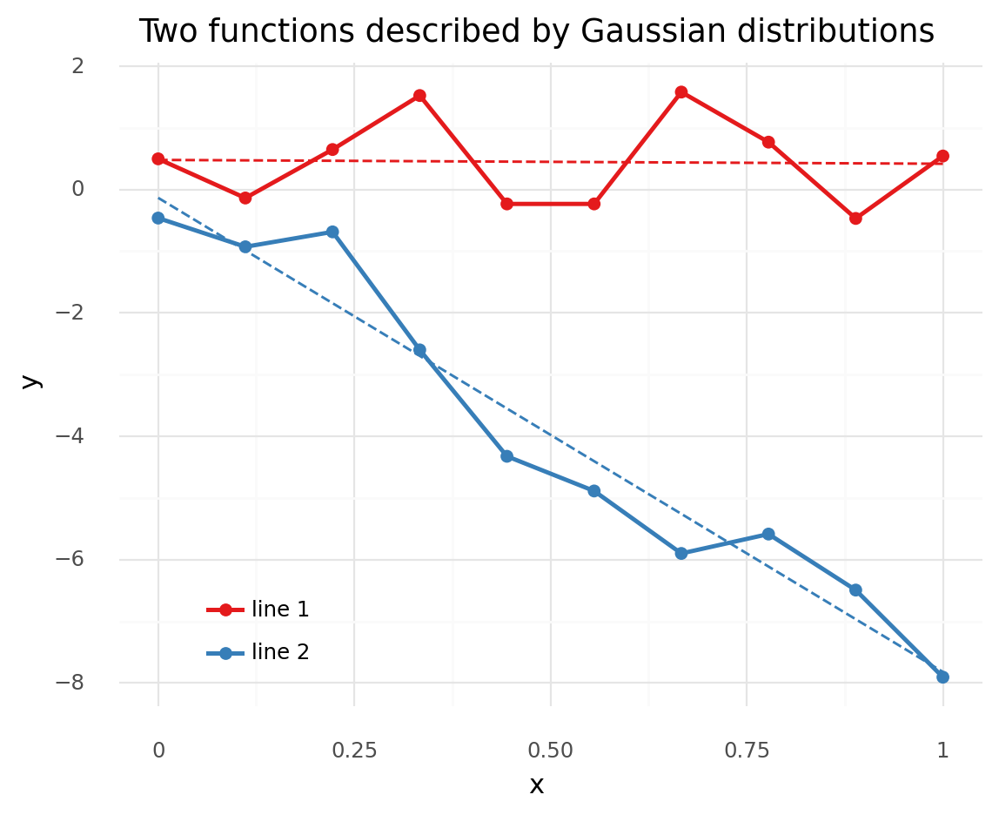

    <ggplot: (8779702401166)>

### Multivariate Gaussians and functions

- can use the *covariance matrix* to encode information baout how data points are related to each other
    - example: `np.random.normal(0, 1, len(x)` is equivalent to `np.random.multivariate_normal(np.zeros_like(x), np.eye(len(x))`
    - the diagonal is the variance of each individual point
    - the off-diagonals represent covariances between points (i.e. dependency relationships between the points)
    - *thus, can use a multivariance Gasussian with a suitable covariance matrix to represent functions probabilistically*

```python
means = np.zeros_like(x)
cov_matrix = np.eye(len(x))
cov_matrix
```

    array([[1., 0., 0., 0., 0., 0., 0., 0., 0., 0.],
           [0., 1., 0., 0., 0., 0., 0., 0., 0., 0.],
           [0., 0., 1., 0., 0., 0., 0., 0., 0., 0.],
           [0., 0., 0., 1., 0., 0., 0., 0., 0., 0.],
           [0., 0., 0., 0., 1., 0., 0., 0., 0., 0.],
           [0., 0., 0., 0., 0., 1., 0., 0., 0., 0.],
           [0., 0., 0., 0., 0., 0., 1., 0., 0., 0.],
           [0., 0., 0., 0., 0., 0., 0., 1., 0., 0.],
           [0., 0., 0., 0., 0., 0., 0., 0., 1., 0.],
           [0., 0., 0., 0., 0., 0., 0., 0., 0., 1.]])

```python
np.random.multivariate_normal(mean=means, cov=cov_matrix)
```

    array([ 1.46564877, -0.2257763 ,  0.0675282 , -1.42474819, -0.54438272,
            0.11092259, -1.15099358,  0.37569802, -0.60063869, -0.29169375])

### Covariance functions and kernels

- specify a covariance matrix using functions called **kernels**
    - kernel: a symmetric function that takes 2 inputs and returns a value of zero if the inputs are the same or a a positive value otherwise
    - output of a kernel function is the measure f similarity between the inputs
    - useful kernel is the *expoentiated quadratic kernel* or *Gaussian kernel*

$$
K(x, x^\prime) = \exp(-\frac{||x-x^\prime||^2}{2\ell^2}
$$

- where:
    - $||x-x^\prime||^2$: Euclidean distance
    - $\ell$: "length-scale" controls the width of the kernel (a.k.a "bandwidth" or "variance")
- example kernel to show how a $4\times4$ covariance matrix looks with different inputs

> The kernel is translating the distance of the data points along the x axis to values of covariances for values of the expected function (on the y axis).
> Thus, the closer two points are on the x axis, the more similar we expect their values to be on the y axis.

```python
def exp_quad_kernel(x, knots, l=1):
    return np.array([np.exp(-((x - k) ** 2) / (2 * l ** 2)) for k in knots])


x = np.arange(-1, 3)
cov = exp_quad_kernel(x, x, l=1)


def plot_covariance_matrix(cov_mat, figure_size=None):
    nrows = cov_mat.shape[0]
    cov_df = pd.DataFrame(cov_mat)
    cov_df["rows"] = np.arange(0, nrows)
    cov_df = cov_df.melt(id_vars="rows", var_name="cols", value_name="value")
    cov_df["rows"] = pd.Categorical(cov_df["rows"], ordered=True)
    cov_df["cols"] = pd.Categorical(
        cov_df["cols"], categories=np.flip(np.arange(0, nrows)), ordered=True
    )
    cov_df["labels"] = np.round(cov_df["value"], 2)
    return (
        gg.ggplot(cov_df, gg.aes(x="rows", y="cols"))
        + gg.geom_tile(gg.aes(fill="value"))
        + gg.geom_label(gg.aes(label="labels"), label_size=0, alpha=0.7)
        + gg.scale_x_discrete(expand=(0, 0.5, 0, 0.5))
        + gg.scale_y_discrete(expand=(0, 0.5, 0, 0.5))
        + gg.coord_equal()
        + gg.theme(
            figure_size=figure_size,
            axis_title=gg.element_blank(),
            legend_position="none",
        )
        + gg.labs(title="Covariance matrix")
    )


plot_covariance_matrix(cov, figure_size=(4, 4))
```

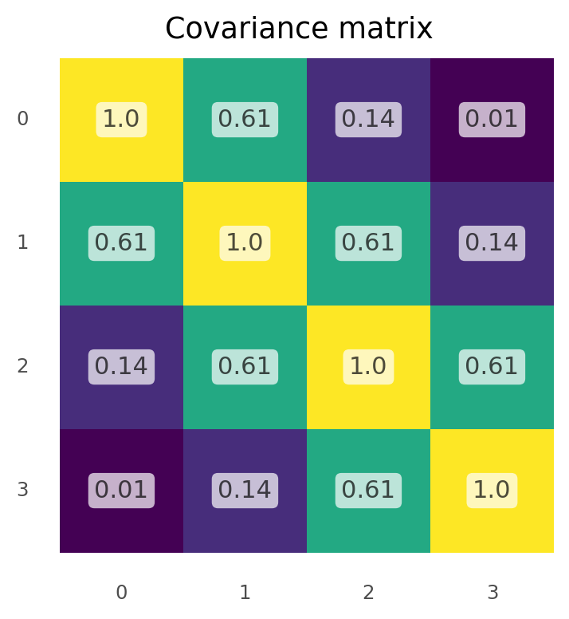

    <ggplot: (8779695596981)>

```python
x = np.array([-1, -2, 0, 0, 2, 2.1, 2.2, 0.5])
cov = exp_quad_kernel(x, x, l=1)
plot_covariance_matrix(cov, figure_size=(6, 6))
```

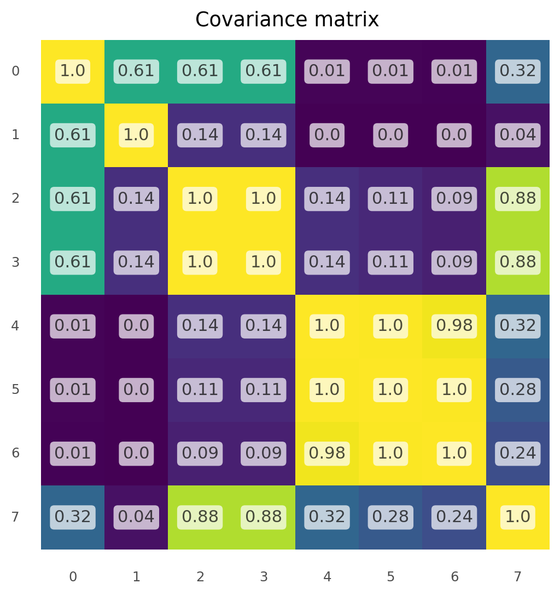

    <ggplot: (8779702561961)>

- so far have shown we can use multivarite normal distributions to model functions
- the following example uses the expoentiated quadratic kernel to define a covariance matrix of a multivariate normal and we use samples from the distribution to represent the functions
    - see the parameter $\ell$ controls the smoothness

```python
np.random.seed(0)
x = np.linspace(0, 10, 200)

data = None
n_rvs = 3
l_order = []
for l in (0.2, 1, 2, 10):
    cov = exp_quad_kernel(x, x, l=l)
    y = stats.multivariate_normal.rvs(cov=cov, size=n_rvs).T
    d = {f"y{i}": y[:, i] for i in range(n_rvs)}
    d["x"] = x
    d["l"] = f"$\\ell = {l}$"
    l_order.append(d["l"])
    data = pd.concat([data, pd.DataFrame(d)])

data = data.melt(id_vars=["x", "l"], var_name="y_id", value_name="y")
data["l"] = pd.Categorical(data["l"], categories=l_order, ordered=True)

(
    gg.ggplot(data, gg.aes(x="x", y="y"))
    + gg.facet_wrap("l")
    + gg.geom_line(gg.aes(color="y_id"), size=1, alpha=0.8)
    + gg.scale_color_brewer(type="qual", palette="Set1")
    + gg.theme(legend_position="none")
)
```

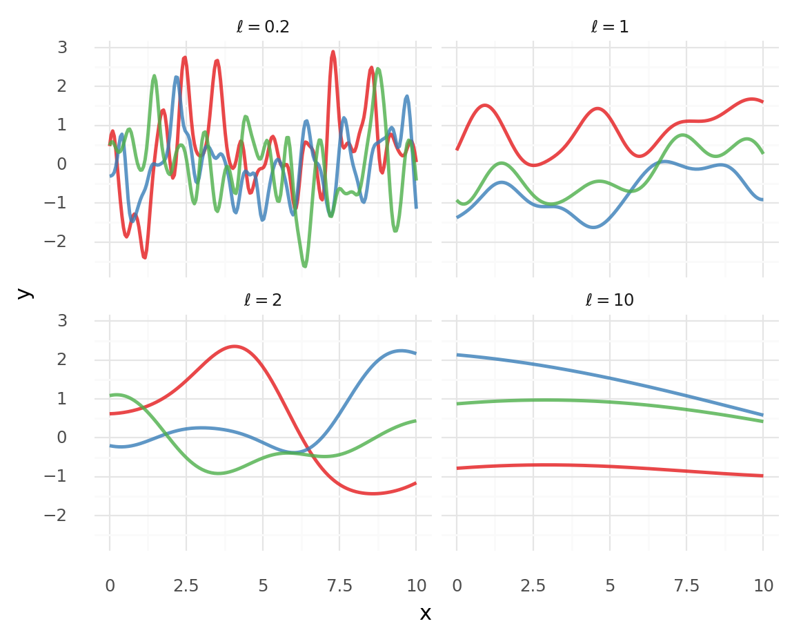

    <ggplot: (8779704266072)>

### Gaussian processes

- definition from Wikipedia: "The collection of random variables indexed by time or space, such that every finite collection of those random variables has a multivariate normal distribution, i.e. every finite linear combination of them is normally distributed."
    - need not consider  the infinite mathematical object, instead marginalize over the observed data by reducing the dimensions to the number of data points we have
- GPs are useful for building Bayesian non-parametric models, as we can use them as prior distributions over functions

## Gaussian process regression

- model a value $y$ as a function $\mathcal{f}$ of $x$ with some noise $\epsilon$:

$$
y \sim \mathcal{N}(\mu = \mathcal{f}(x), \sigma=\epsilon) \quad \epsilon \sim \mathcal{N}(0, \sigma_\epsilon)
$$

- now add a prior distribution to $\mathcal{f}$ using a GP

$$
f(x) \sim \mathcal{GP}(\mu_x, K(x, x^\prime))
$$

- where:
    - $\mu_x$: mean function
    - $K(x, x^\prime)$: kernel or covariance function
- since the prior distribution of a GP is normal and the likelihood is normal, then the posterior is also a GP:

$$
p(f(X_*) | X_*, X, y) \sim \mathcal{N}(\mu, \Sigma) \\
\mu = K_*^T K^{-1} y \\
\Sigma = K_{**} - K_*^T K^{-1} K_*
$$

- where:
    - $K = K(X, X)$
    - $K_* = K(X_*, X)$
    - $K_{**} = K(X_*, X_*)$
    - $X$: observed data
    - $X_*$: test data points
- example with modeling a GP using PyMC3:
    - create some data folowing a sine curve

```python
np.random.seed(42)

x = np.random.uniform(0, 10, size=15)
y = np.random.normal(np.sin(x), 0.1)
d = pd.DataFrame({"x": x, "y": y})

x_true = np.linspace(0, 10, 100)
y_true = np.sin(x_true)
d_true = pd.DataFrame({"x": x_true, "y": y_true})

(
    gg.ggplot(d, gg.aes("x", "y"))
    + gg.geom_point(color="blue")
    + gg.geom_line(data=d_true, linetype="--")
    + gg.labs(title="Synthetic data for GP model")
)
```

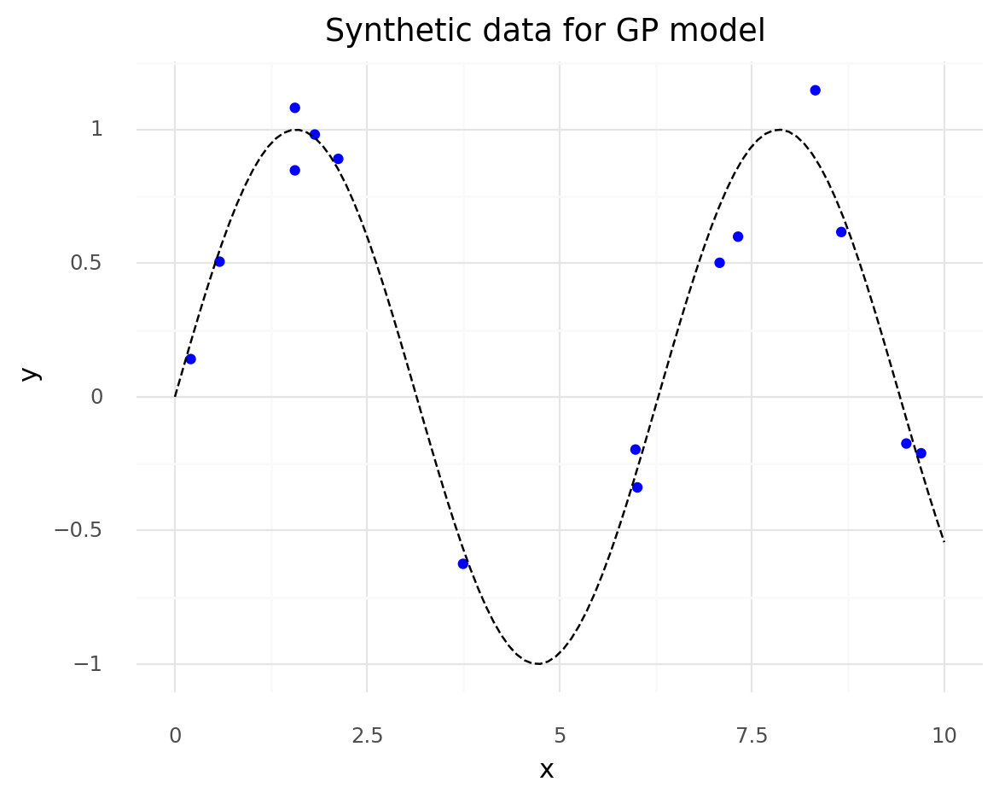

    <ggplot: (8779702417785)>

- to model, need to find:
    - $\epsilon$: the variance of the normal likelihood
    - $\ell$: length-scale parameter of the kernel

```python
X = x[:, None]

with pm.Model() as model_reg:
    # Hyperprior for length-scale kernel parameter.
    l = pm.Gamma("l", 2, 0.5)
    # Covariance function.
    cov = pm.gp.cov.ExpQuad(1, ls=l)
    # GP prior over f.
    gp = pm.gp.Marginal(cov_func=cov)
    # Prior for noise.
    epsilon = pm.HalfNormal("epsilon", 25)
    # Likelihood.
    y_pred = gp.marginal_likelihood("y_pred", X=X, y=y, noise=epsilon)
    # Sample.
    trace_reg = pm.sample(1000, tune=1000)
```

    Auto-assigning NUTS sampler...
    Initializing NUTS using jitter+adapt_diag...
    Multiprocess sampling (2 chains in 2 jobs)
    NUTS: [epsilon, l]

<div>
    <style>
        /*Turns off some styling*/
        progress {
            /*gets rid of default border in Firefox and Opera.*/
            border: none;
            /*Needs to be in here for Safari polyfill so background images work as expected.*/
            background-size: auto;
        }
        .progress-bar-interrupted, .progress-bar-interrupted::-webkit-progress-bar {
            background: #F44336;
        }
    </style>
  <progress value='4000' class='' max='4000' style='width:300px; height:20px; vertical-align: middle;'></progress>
  100.00% [4000/4000 00:36<00:00 Sampling 2 chains, 0 divergences]
</div>

    Sampling 2 chains for 1_000 tune and 1_000 draw iterations (2_000 + 2_000 draws total) took 45 seconds.

```python
pm.model_to_graphviz(model_reg)
```

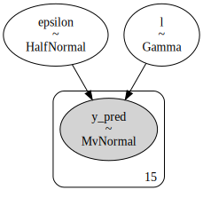

```python
az.plot_trace(trace_reg)
plt.show()
```

    /usr/local/Caskroom/miniconda/base/envs/bayesian-analysis-with-python_e2/lib/python3.9/site-packages/arviz/data/io_pymc3.py:87: FutureWarning: Using `from_pymc3` without the model will be deprecated in a future release. Not using the model will return less accurate and less useful results. Make sure you use the model argument or call from_pymc3 within a model context.

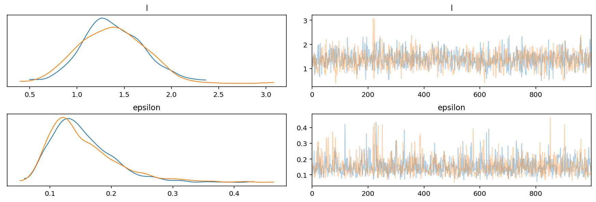

- can get samples from the GP posterior by computing the conditional distribution evaluated over new input locations

```python
X_new = np.linspace(np.floor(x.min()), np.ceil(x.max()), 100)[:, None]

with model_reg:
    f_pred = gp.conditional("f_pred", X_new)
    pred_samples = pm.sample_posterior_predictive(trace_reg, vars=[f_pred], samples=200)
```

    /usr/local/Caskroom/miniconda/base/envs/bayesian-analysis-with-python_e2/lib/python3.9/site-packages/pymc3/sampling.py:1707: UserWarning: samples parameter is smaller than nchains times ndraws, some draws and/or chains may not be represented in the returned posterior predictive sample

<div>
    <style>
        /*Turns off some styling*/
        progress {
            /*gets rid of default border in Firefox and Opera.*/
            border: none;
            /*Needs to be in here for Safari polyfill so background images work as expected.*/
            background-size: auto;
        }
        .progress-bar-interrupted, .progress-bar-interrupted::-webkit-progress-bar {
            background: #F44336;
        }
    </style>
  <progress value='200' class='' max='200' style='width:300px; height:20px; vertical-align: middle;'></progress>
  100.00% [200/200 00:06<00:00]
</div>

```python
gp_post = pd.DataFrame(pred_samples["f_pred"].T)
gp_post["x"] = X_new[:, 0]
gp_post = gp_post.melt(id_vars="x", var_name="sample_idx", value_name="y")
(
    gg.ggplot(gp_post, gg.aes(x="x", y="y"))
    + gg.geom_line(gg.aes(group="sample_idx"), alpha=0.07)
    + gg.geom_point(data=d, color="blue")
    + gg.labs(title="Posterior samples of the GP")
)
```

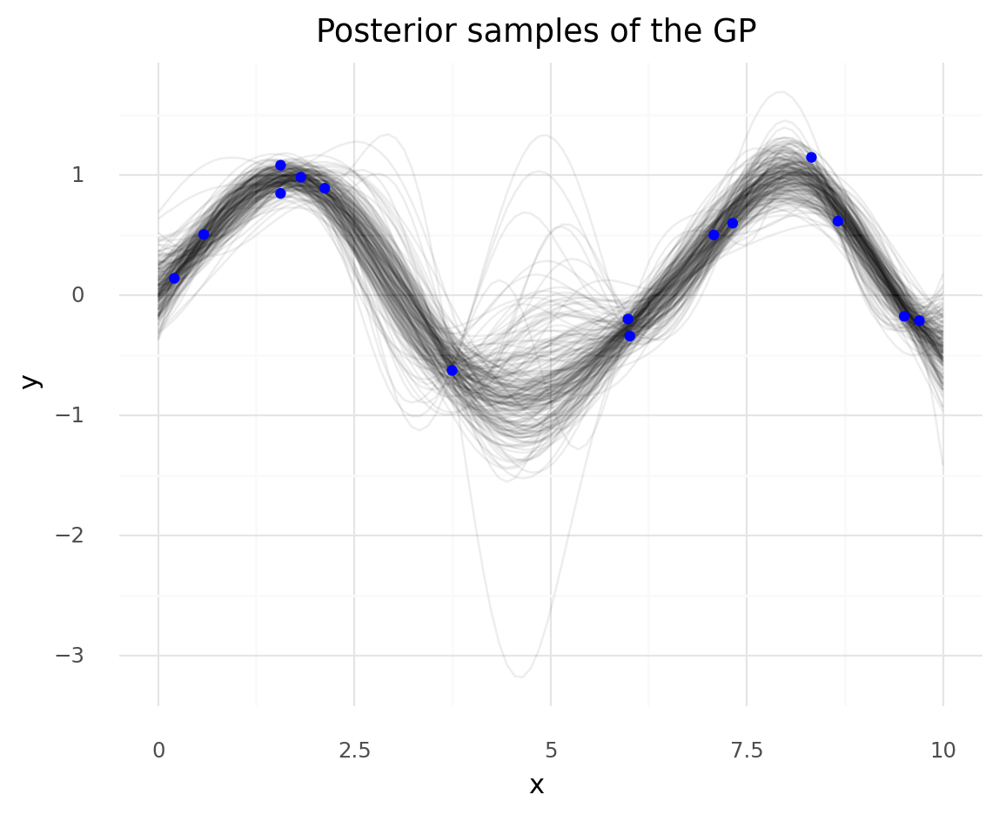

    <ggplot: (8779707273048)>

- can compute the mean vector and standard deviation of the conditional distribution at each point in the parameter space
    - use the mean values for $\ell$ and $\epsilon$

```python
point = {"l": trace_reg["l"].mean(), "epsilon": trace_reg["epsilon"].mean()}
point
```

    {'l': 1.3755161852833542, 'epsilon': 0.15409951350806478}

```python
mu, var = gp.predict(X_new, point=point, diag=True)
sd = var ** 0.5
gp_post2 = pd.DataFrame(
    {
        "x": X_new.flatten(),
        "mu": mu,
        "sd_low": mu - sd,
        "sd_high": mu + sd,
        "2sd_low": mu - 2 * sd,
        "2sd_high": mu + 2 * sd,
    }
)

color = "#FF5548"

(
    gg.ggplot(gp_post2, gg.aes(x="x"))
    + gg.geom_ribbon(gg.aes(ymin="2sd_low", ymax="2sd_high"), alpha=0.2, fill=color)
    + gg.geom_ribbon(gg.aes(ymin="sd_low", ymax="sd_high"), alpha=0.2, fill=color)
    + gg.geom_line(gg.aes(y="mu"), color=color, size=1)
    + gg.geom_point(gg.aes(y="y"), data=d)
    + gg.labs(title="Mean posterior of GP")
)
```


    <ggplot: (8779706219539)>

- can use non-Gaussian likelihoods and inverse functions to generalize GPs (discussed next)
    - however, these are not analytically tractable like the Gaussian example above

## Regression with spatial autocorrelation

- example: (taken from *Statistical Rethinking*)
    - 10 different island-societies
    - for each island, we have the number of tools they use
    - we believe larger populations thrive because they develop and keep more tools
    - another factor could be contact rates
- model the number of tools as a Poisson distribution of the population size
    - use lagarithm of population size to focus on the magnitudes
    - use distance as a proxy for contact rate

```python
# Distances between islands.
islands_dist = pd.read_csv(Path("data", "islands_dist.csv"), index_col=0)
islands_dist.round(1)
```

<div>
<style scoped>
    .dataframe tbody tr th:only-of-type {
        vertical-align: middle;
    }

    .dataframe tbody tr th {
        vertical-align: top;
    }

    .dataframe thead th {
        text-align: right;
    }
</style>
<table border="1" class="dataframe">
  <thead>
    <tr style="text-align: right;">
      <th></th>
      <th>Ml</th>
      <th>Ti</th>
      <th>SC</th>
      <th>Ya</th>
      <th>Fi</th>
      <th>Tr</th>
      <th>Ch</th>
      <th>Mn</th>
      <th>To</th>
      <th>Ha</th>
    </tr>
  </thead>
  <tbody>
    <tr>
      <th>Malekula</th>
      <td>0.0</td>
      <td>0.5</td>
      <td>0.6</td>
      <td>4.4</td>
      <td>1.2</td>
      <td>2.0</td>
      <td>3.2</td>
      <td>2.8</td>
      <td>1.9</td>
      <td>5.7</td>
    </tr>
    <tr>
      <th>Tikopia</th>
      <td>0.5</td>
      <td>0.0</td>
      <td>0.3</td>
      <td>4.2</td>
      <td>1.2</td>
      <td>2.0</td>
      <td>2.9</td>
      <td>2.7</td>
      <td>2.0</td>
      <td>5.3</td>
    </tr>
    <tr>
      <th>Santa Cruz</th>
      <td>0.6</td>
      <td>0.3</td>
      <td>0.0</td>
      <td>3.9</td>
      <td>1.6</td>
      <td>1.7</td>
      <td>2.6</td>
      <td>2.4</td>
      <td>2.3</td>
      <td>5.4</td>
    </tr>
    <tr>
      <th>Yap</th>
      <td>4.4</td>
      <td>4.2</td>
      <td>3.9</td>
      <td>0.0</td>
      <td>5.4</td>
      <td>2.5</td>
      <td>1.6</td>
      <td>1.6</td>
      <td>6.1</td>
      <td>7.2</td>
    </tr>
    <tr>
      <th>Lau Fiji</th>
      <td>1.2</td>
      <td>1.2</td>
      <td>1.6</td>
      <td>5.4</td>
      <td>0.0</td>
      <td>3.2</td>
      <td>4.0</td>
      <td>3.9</td>
      <td>0.8</td>
      <td>4.9</td>
    </tr>
    <tr>
      <th>Trobriand</th>
      <td>2.0</td>
      <td>2.0</td>
      <td>1.7</td>
      <td>2.5</td>
      <td>3.2</td>
      <td>0.0</td>
      <td>1.8</td>
      <td>0.8</td>
      <td>3.9</td>
      <td>6.7</td>
    </tr>
    <tr>
      <th>Chuuk</th>
      <td>3.2</td>
      <td>2.9</td>
      <td>2.6</td>
      <td>1.6</td>
      <td>4.0</td>
      <td>1.8</td>
      <td>0.0</td>
      <td>1.2</td>
      <td>4.8</td>
      <td>5.8</td>
    </tr>
    <tr>
      <th>Manus</th>
      <td>2.8</td>
      <td>2.7</td>
      <td>2.4</td>
      <td>1.6</td>
      <td>3.9</td>
      <td>0.8</td>
      <td>1.2</td>
      <td>0.0</td>
      <td>4.6</td>
      <td>6.7</td>
    </tr>
    <tr>
      <th>Tonga</th>
      <td>1.9</td>
      <td>2.0</td>
      <td>2.3</td>
      <td>6.1</td>
      <td>0.8</td>
      <td>3.9</td>
      <td>4.8</td>
      <td>4.6</td>
      <td>0.0</td>
      <td>5.0</td>
    </tr>
    <tr>
      <th>Hawaii</th>
      <td>5.7</td>
      <td>5.3</td>
      <td>5.4</td>
      <td>7.2</td>
      <td>4.9</td>
      <td>6.7</td>
      <td>5.8</td>
      <td>6.7</td>
      <td>5.0</td>
      <td>0.0</td>
    </tr>
  </tbody>
</table>
</div>

```python
# Data about island-societies.
islands = pd.read_csv(Path("data", "islands.csv"))
islands.round(1)
```

<div>
<style scoped>
    .dataframe tbody tr th:only-of-type {
        vertical-align: middle;
    }

    .dataframe tbody tr th {
        vertical-align: top;
    }

    .dataframe thead th {
        text-align: right;
    }
</style>
<table border="1" class="dataframe">
  <thead>
    <tr style="text-align: right;">
      <th></th>
      <th>culture</th>
      <th>population</th>
      <th>contact</th>
      <th>total_tools</th>
      <th>mean_TU</th>
      <th>lat</th>
      <th>lon</th>
      <th>lon2</th>
      <th>logpop</th>
    </tr>
  </thead>
  <tbody>
    <tr>
      <th>0</th>
      <td>Malekula</td>
      <td>1100</td>
      <td>low</td>
      <td>13</td>
      <td>3.2</td>
      <td>-16.3</td>
      <td>167.5</td>
      <td>-12.5</td>
      <td>7.0</td>
    </tr>
    <tr>
      <th>1</th>
      <td>Tikopia</td>
      <td>1500</td>
      <td>low</td>
      <td>22</td>
      <td>4.7</td>
      <td>-12.3</td>
      <td>168.8</td>
      <td>-11.2</td>
      <td>7.3</td>
    </tr>
    <tr>
      <th>2</th>
      <td>Santa Cruz</td>
      <td>3600</td>
      <td>low</td>
      <td>24</td>
      <td>4.0</td>
      <td>-10.7</td>
      <td>166.0</td>
      <td>-14.0</td>
      <td>8.2</td>
    </tr>
    <tr>
      <th>3</th>
      <td>Yap</td>
      <td>4791</td>
      <td>high</td>
      <td>43</td>
      <td>5.0</td>
      <td>9.5</td>
      <td>138.1</td>
      <td>-41.9</td>
      <td>8.5</td>
    </tr>
    <tr>
      <th>4</th>
      <td>Lau Fiji</td>
      <td>7400</td>
      <td>high</td>
      <td>33</td>
      <td>5.0</td>
      <td>-17.7</td>
      <td>178.1</td>
      <td>-1.9</td>
      <td>8.9</td>
    </tr>
    <tr>
      <th>5</th>
      <td>Trobriand</td>
      <td>8000</td>
      <td>high</td>
      <td>19</td>
      <td>4.0</td>
      <td>-8.7</td>
      <td>150.9</td>
      <td>-29.1</td>
      <td>9.0</td>
    </tr>
    <tr>
      <th>6</th>
      <td>Chuuk</td>
      <td>9200</td>
      <td>high</td>
      <td>40</td>
      <td>3.8</td>
      <td>7.4</td>
      <td>151.6</td>
      <td>-28.4</td>
      <td>9.1</td>
    </tr>
    <tr>
      <th>7</th>
      <td>Manus</td>
      <td>13000</td>
      <td>low</td>
      <td>28</td>
      <td>6.6</td>
      <td>-2.1</td>
      <td>146.9</td>
      <td>-33.1</td>
      <td>9.5</td>
    </tr>
    <tr>
      <th>8</th>
      <td>Tonga</td>
      <td>17500</td>
      <td>high</td>
      <td>55</td>
      <td>5.4</td>
      <td>-21.2</td>
      <td>-175.2</td>
      <td>4.8</td>
      <td>9.8</td>
    </tr>
    <tr>
      <th>9</th>
      <td>Hawaii</td>
      <td>275000</td>
      <td>low</td>
      <td>71</td>
      <td>6.6</td>
      <td>19.9</td>
      <td>-155.6</td>
      <td>24.4</td>
      <td>12.5</td>
    </tr>
  </tbody>
</table>
</div>

```python
islands_dist_sqr = islands_dist.values ** 2
culture_labels = islands.culture.values
index = islands.index.values
log_pop = islands.logpop
total_tools = islands.total_tools
x_data = [islands.lat.values[:, None], islands.lon.values[:, None]]
```

- model to build (ignoring the standard hyperpriors, etc):

$$
y \sim \text{Poisson}(\mu) \\
\mu \sim \exp(\alpha + \beta x + \mathcal{f}) \\
\mathcal{f} \sim \mathcal{GP}([0, \dots, 0], K(x, x^\prime)
$$

- same as a Possion regression GLM but the terms in the linear model $\methcal{f}$ come from a GP
    - use the island distances to compute the kernel
        - incorporates a measure of similarity between the data points

```python
with pm.Model() as model_islands:
    eta = pm.HalfCauchy("eta", 1)
    l = pm.HalfCauchy("l", 1)

    cov = eta * pm.gp.cov.ExpQuad(1, ls=l)
    gp = pm.gp.Latent(cov_func=cov)
    f = gp.prior("f", X=islands_dist_sqr)

    alpha = pm.Normal("alpha", 0, 10)
    beta = pm.Normal("beta", 0, 1)
    mu = pm.math.exp(alpha + f[index] + beta * log_pop)
    tt_pred = pm.Poisson("tt_pred", mu, observed=total_tools)
```

    /usr/local/Caskroom/miniconda/base/envs/bayesian-analysis-with-python_e2/lib/python3.9/site-packages/pymc3/gp/cov.py:90: UserWarning: Only 1 column(s) out of 10 are being used to compute the covariance function. If this is not intended, increase 'input_dim' parameter to the number of columns to use. Ignore otherwise.

```python
pm.model_to_graphviz(model_islands)
```

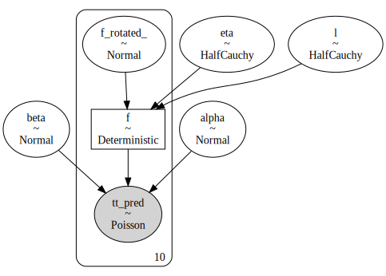

```python
with model_islands:
    trace_islands = pm.sample(1000, tune=1000)
```

    Auto-assigning NUTS sampler...
    Initializing NUTS using jitter+adapt_diag...
    Multiprocess sampling (2 chains in 2 jobs)
    NUTS: [beta, alpha, f_rotated_, l, eta]

<div>
    <style>
        /*Turns off some styling*/
        progress {
            /*gets rid of default border in Firefox and Opera.*/
            border: none;
            /*Needs to be in here for Safari polyfill so background images work as expected.*/
            background-size: auto;
        }
        .progress-bar-interrupted, .progress-bar-interrupted::-webkit-progress-bar {
            background: #F44336;
        }
    </style>
  <progress value='4000' class='' max='4000' style='width:300px; height:20px; vertical-align: middle;'></progress>
  100.00% [4000/4000 04:04<00:00 Sampling 2 chains, 35 divergences]
</div>

    Sampling 2 chains for 1_000 tune and 1_000 draw iterations (2_000 + 2_000 draws total) took 255 seconds.
    There were 9 divergences after tuning. Increase `target_accept` or reparameterize.
    The acceptance probability does not match the target. It is 0.8977309206438002, but should be close to 0.8. Try to increase the number of tuning steps.
    There were 26 divergences after tuning. Increase `target_accept` or reparameterize.
    The estimated number of effective samples is smaller than 200 for some parameters.

- plot some samples of the posterior distribution of covariance functions in terms of distances
    - the covariance is not very high on average and drops to 0 around 2,000 km
    - the samples are quite varying showing there is a lot of uncertainty in the estimate of covariance

```python
trace_eta = trace_islands["eta"]
trace_l = trace_islands["l"]

xrange = np.linspace(0, islands_dist.values.max(), 1000)

islands_post_summary = pd.DataFrame(
    {"x": xrange, "y": np.median(trace_eta) * np.exp(-np.median(trace_l) * xrange ** 2)}
)

islands_post_df = pd.DataFrame(
    (trace_eta[::20][:, None] * np.exp(-trace_l[::20][:, None] * xrange ** 2)).T
)
islands_post_df["x"] = xrange
islands_post_df = islands_post_df.melt(
    id_vars="x", var_name="sample_idx", value_name="y"
)
(
    gg.ggplot(islands_post_summary, gg.aes("x", "y"))
    + gg.geom_line(gg.aes(group="sample_idx"), data=islands_post_df, alpha=0.1)
    + gg.geom_line(color="#0C73B4", size=1.5)
    + gg.scale_y_continuous(expand=(0, 0.01, 0, 0), limits=(0, 1))
    + gg.labs(
        x="distance (thousand km)",
        y="covariance",
        title="Posterior of the covariance function",
    )
)
```

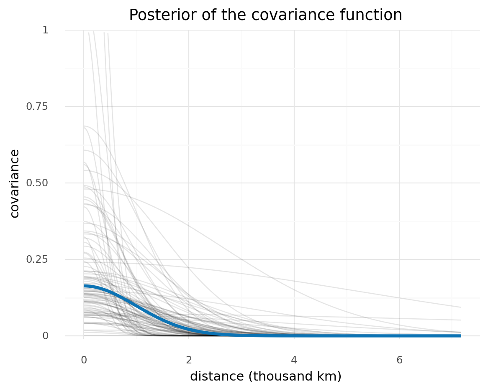

    <ggplot: (8779677201860)>

- explore how strong the islands are correlated according to the model
- turn the covariance matrix into a correlation matrix

```python
# Compute posterior median covariance among societies.
sigma = np.median(trace_eta) * (np.exp(-np.median(trace_l) * islands_dist_sqr))
# Convert to correlation matrix.
sigma_post = np.diag(np.diag(sigma) ** (-0.5))
rho = sigma_post @ sigma @ sigma_post
rho = pd.DataFrame(rho, index=islands_dist.columns, columns=islands_dist.columns)
rho.round(2)
```

<div>
<style scoped>
    .dataframe tbody tr th:only-of-type {
        vertical-align: middle;
    }

    .dataframe tbody tr th {
        vertical-align: top;
    }

    .dataframe thead th {
        text-align: right;
    }
</style>
<table border="1" class="dataframe">
  <thead>
    <tr style="text-align: right;">
      <th></th>
      <th>Ml</th>
      <th>Ti</th>
      <th>SC</th>
      <th>Ya</th>
      <th>Fi</th>
      <th>Tr</th>
      <th>Ch</th>
      <th>Mn</th>
      <th>To</th>
      <th>Ha</th>
    </tr>
  </thead>
  <tbody>
    <tr>
      <th>Ml</th>
      <td>1.00</td>
      <td>0.89</td>
      <td>0.82</td>
      <td>0.00</td>
      <td>0.46</td>
      <td>0.12</td>
      <td>0.01</td>
      <td>0.02</td>
      <td>0.17</td>
      <td>0.0</td>
    </tr>
    <tr>
      <th>Ti</th>
      <td>0.89</td>
      <td>1.00</td>
      <td>0.95</td>
      <td>0.00</td>
      <td>0.46</td>
      <td>0.13</td>
      <td>0.01</td>
      <td>0.03</td>
      <td>0.14</td>
      <td>0.0</td>
    </tr>
    <tr>
      <th>SC</th>
      <td>0.82</td>
      <td>0.95</td>
      <td>1.00</td>
      <td>0.00</td>
      <td>0.29</td>
      <td>0.23</td>
      <td>0.03</td>
      <td>0.06</td>
      <td>0.07</td>
      <td>0.0</td>
    </tr>
    <tr>
      <th>Ya</th>
      <td>0.00</td>
      <td>0.00</td>
      <td>0.00</td>
      <td>1.00</td>
      <td>0.00</td>
      <td>0.05</td>
      <td>0.29</td>
      <td>0.27</td>
      <td>0.00</td>
      <td>0.0</td>
    </tr>
    <tr>
      <th>Fi</th>
      <td>0.46</td>
      <td>0.46</td>
      <td>0.29</td>
      <td>0.00</td>
      <td>1.00</td>
      <td>0.01</td>
      <td>0.00</td>
      <td>0.00</td>
      <td>0.74</td>
      <td>0.0</td>
    </tr>
    <tr>
      <th>Tr</th>
      <td>0.12</td>
      <td>0.13</td>
      <td>0.23</td>
      <td>0.05</td>
      <td>0.01</td>
      <td>1.00</td>
      <td>0.19</td>
      <td>0.69</td>
      <td>0.00</td>
      <td>0.0</td>
    </tr>
    <tr>
      <th>Ch</th>
      <td>0.01</td>
      <td>0.01</td>
      <td>0.03</td>
      <td>0.29</td>
      <td>0.00</td>
      <td>0.19</td>
      <td>1.00</td>
      <td>0.47</td>
      <td>0.00</td>
      <td>0.0</td>
    </tr>
    <tr>
      <th>Mn</th>
      <td>0.02</td>
      <td>0.03</td>
      <td>0.06</td>
      <td>0.27</td>
      <td>0.00</td>
      <td>0.69</td>
      <td>0.47</td>
      <td>1.00</td>
      <td>0.00</td>
      <td>0.0</td>
    </tr>
    <tr>
      <th>To</th>
      <td>0.17</td>
      <td>0.14</td>
      <td>0.07</td>
      <td>0.00</td>
      <td>0.74</td>
      <td>0.00</td>
      <td>0.00</td>
      <td>0.00</td>
      <td>1.00</td>
      <td>0.0</td>
    </tr>
    <tr>
      <th>Ha</th>
      <td>0.00</td>
      <td>0.00</td>
      <td>0.00</td>
      <td>0.00</td>
      <td>0.00</td>
      <td>0.00</td>
      <td>0.00</td>
      <td>0.00</td>
      <td>0.00</td>
      <td>1.0</td>
    </tr>
  </tbody>
</table>
</div>

- can plot the correlation network on the geographical locations of the islands

```python
logpop = np.copy(log_pop) / np.max(log_pop)
psize = np.exp(logpop * 5.5)
log_pop_seq = np.linspace(6, 14, 100)
lambda_post = np.exp(
    trace_islands["alpha"][:, None] + trace_islands["beta"][:, None] * log_pop_seq
)

plot_data = pd.DataFrame(
    {
        "lon2": islands.lon2,
        "lat": islands.lat,
        "pop_size": psize,
        "island": culture_labels,
    }
)

network_data = {
    "island1": [],
    "island2": [],
    "lon1": [],
    "lon2": [],
    "lat1": [],
    "lat2": [],
    "corr": [],
}
for i in range(10):
    for j in range(i + 1, 10):
        network_data["island1"] += [islands.culture[i]]
        network_data["island2"] += [islands.culture[j]]
        network_data["lon1"] += [islands.lon2[i]]
        network_data["lat1"] += [islands.lat[i]]
        network_data["lon2"] += [islands.lon2[j]]
        network_data["lat2"] += [islands.lat[j]]
        network_data["corr"] += [rho.iloc[i, j] ** 2]

network_data = pd.DataFrame(network_data)

(
    gg.ggplot(plot_data, gg.aes(x="lon2", y="lat"))
    + gg.geom_segment(
        gg.aes(x="lon1", xend="lon2", y="lat1", yend="lat2", alpha="corr"),
        data=network_data,
        size=2,
    )
    + gg.geom_text(gg.aes(label="island"), nudge_x=2, ha="left", alpha=0.8, size=10)
    + gg.geom_point(gg.aes(size="psize"))
    + gg.scale_x_continuous(expand=(0.05, 0, 0, 10))
    + gg.scale_alpha_continuous(range=(0, 1))
    + gg.labs(x="longitude", y="latitude", size="pop. size", alpha="correlation")
)
```

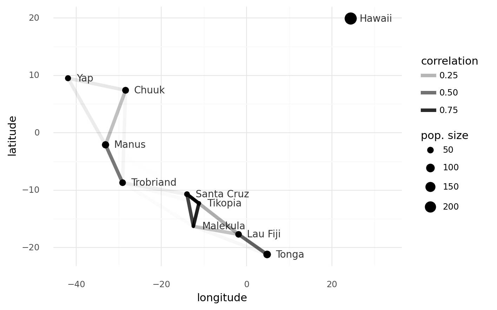

    <ggplot: (8779659861291)>

## Gaussian process classification

```python

```

```python

```

```python

```

```python

```

---

```python
%load_ext watermark
%watermark -d -u -v -iv -b -h -m
```

    Last updated: 2021-01-07
    
    Python implementation: CPython
    Python version       : 3.9.1
    IPython version      : 7.19.0
    
    Compiler    : Clang 10.0.0 
    OS          : Darwin
    Release     : 20.1.0
    Machine     : x86_64
    Processor   : i386
    CPU cores   : 4
    Architecture: 64bit
    
    Hostname: JHCookMac
    
    Git branch: master
    
    plotnine  : 0.7.1
    matplotlib: 3.3.3
    pandas    : 1.2.0
    theano    : 1.0.5
    pymc3     : 3.9.3
    scipy     : 1.6.0
    seaborn   : 0.11.1
    numpy     : 1.19.4
    arviz     : 0.10.0

```python

```
